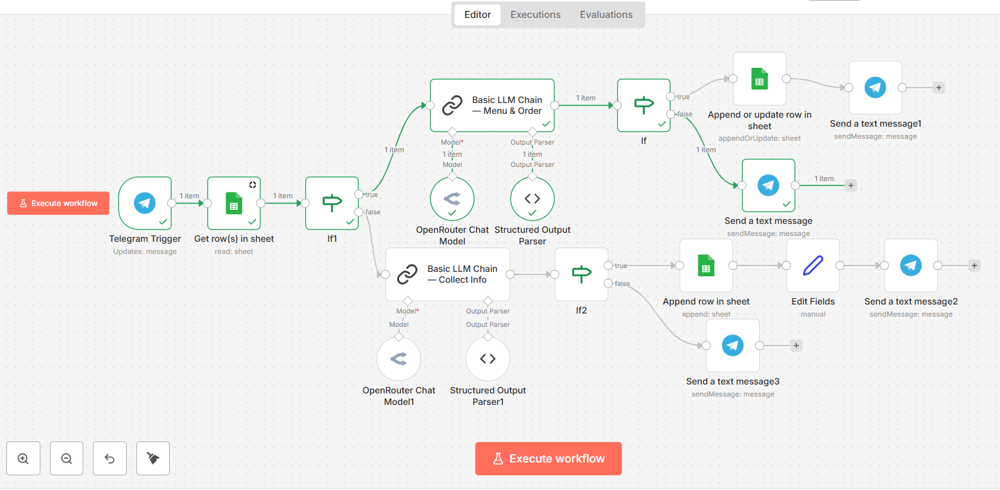

# AI Restaurant Ordering Bot (n8n)

An end-to-end AI-powered restaurant ordering chatbot built using **n8n**, **LLMs**, **Telegram**, and **Google Sheets**.

This project demonstrates how to design a reliable, stateful conversational system using no-code / low-code automation combined with large language models.

---

## 🚀 Features

- Telegram-based chatbot interface
- Automatic customer identification using Telegram ID
- Customer data collection (name & phone number)
- Menu presentation on demand
- Order extraction from natural language (Arabic)
- Order confirmation flow (no infinite loops)
- Structured AI outputs for safe automation
- Orders stored in Google Sheets

---

## 🧠 Architecture Overview

The workflow is designed as a **state-aware, multi-stage pipeline** that separates concerns clearly and avoids common LLM automation pitfalls.

1. **Telegram Trigger**
   - Receives incoming user messages.
   - Extracts `telegram_id` for consistent user identification.

2. **Customer Lookup (Google Sheets)**
   - Checks if the user already exists using `telegram_id`.
   - Routes the flow based on customer existence (new vs returning).

3. **Customer Info Collection (LLM)**
   - Activated only for new users.
   - Collects name and phone number.
   - Uses strict conditions to prevent repeated or unnecessary questions.

4. **Menu & Order Handling (LLM)**
   - Menu is shown **only when explicitly requested**.
   - Orders are extracted from natural Arabic language.
   - AI output is strictly structured (JSON) to ensure safe automation.
   - Prevents ambiguous states and infinite confirmation loops.

5. **Conditional Logic & State Control**
   - IF nodes ensure correct routing based on intent:
     - `order_started`
     - `order_confirmed`
   - Guarantees deterministic behavior across the conversation.

6. **Order Storage**
   - Confirmed orders are stored in Google Sheets.
   - Ensures data consistency and traceability.

7. **Telegram Response**
   - Sends clear confirmations and next-step prompts.
   - Keeps the user experience simple and guided.

---

## 🧩 Technologies Used

- **n8n** – Workflow automation
- **OpenRouter (LLMs)** – Natural language understanding
- **Telegram Bot API** – User interaction
- **Google Sheets** – Lightweight database
- **Structured Output Parsing** – Reliable AI-to-automation bridge

---

## 📂 Files

- `AI Bot Orders.json`  
  Exported n8n workflow (no credentials included).

- `assets/workflow.png`  
  Visual overview of the workflow (optional).

---

## 🔐 Security Notes

- No API keys or credentials are included in this repository.
- All secrets (Telegram token, OpenRouter API key, Google credentials) are managed securely via n8n Credentials.

---

## 🧪 Use Case

This project was built as a practical task during an **n8n automation course**, and extended into a **production-ready AI ordering system** to demonstrate real-world automation patterns.

---

## 📌 Author

Built by **Ahmed Gaitani**  
AI / Automation Engineer

---

## 📎 Preview

A visual overview of the full n8n workflow, showing routing logic, LLM nodes, and integrations:

